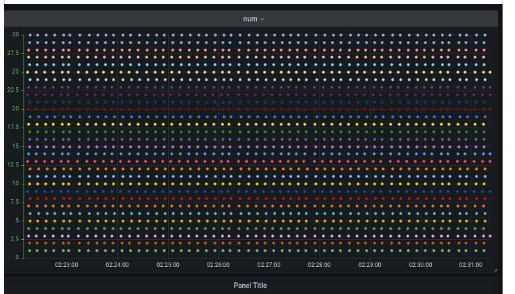
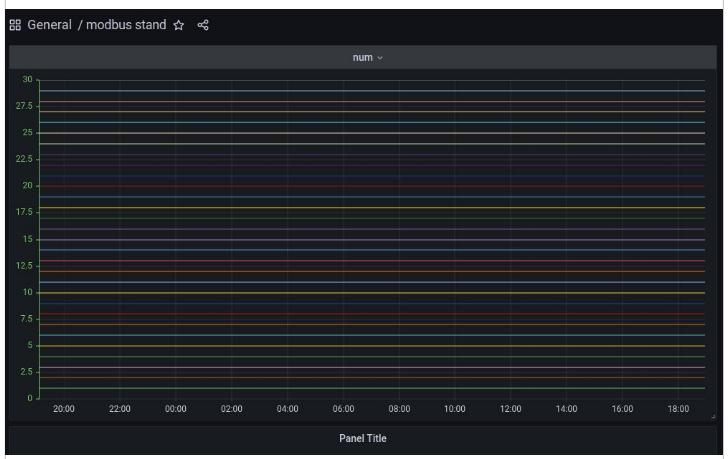
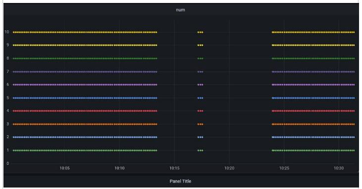

# Даш-боард для Grafana


## Настройте telegraf и influxdb2

> [!NOTE]  
> В NapiLinux все необходимые компоненты уже установлены и 

Для того, чтобы Grafana отображала данные с датчиков стенда, 
необходимо чтобы данные с них были считаны и записывались в базу данных.

Для считывания данных мы используем продукт `telegraf`, конфиг для снятия стенда по Modbus TCP есть в этом репозитории. Для хранения данных мы используем базу данных influx. 

База `influxdb2`должна стоять и быть настроена. 


Часть конфига  `telegraf` для сохранения данных в базе influxdb2

```toml
# Configuration for sending metrics to InfluxDB 2.0
[[outputs.influxdb_v2]]

  urls = ["http://localhost:8086"]

  ## Token for authentication.
  token = "токен базы influx"
  organization = "nnz"
  bucket = "bucket1"
  user_agent = "telegraf"

```
## Иллюстрации

Так как стенд по первому регистру передает свой номер, то мы можем видеть непрерывный отклик 10 датчиков, возвращающих свой номер.

Окно "5 минут" выглядит следующим образом



Окно "12 часов" выглядит следующим образом



Если же были сбои или перерывы, вы увидите их по разрывам линий и сможете посмотреть окна времени, там где были перерывы.

